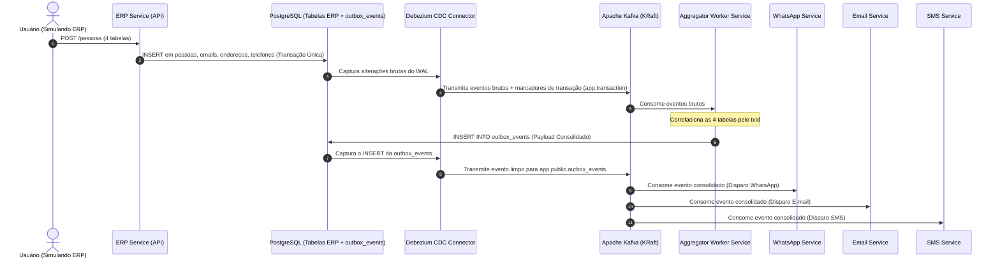

# 🚀 Estudo Outbox Pattern + Change Data Capture (CDC) com Debezium & Apache Kafka

Este repositório contém uma **Prova de Conceito (PoC) completa e containerizada** para demonstrar como integrar sistemas legados/ERPs com microsserviços em tempo real **sem dependência da equipe de banco de dados (zero triggers)** e **sem polling ("de hora em hora consulta o banco")**.

---

## 🏗️ Arquitetura do Projeto (Pipeline em 2 Estágios)



---

## 🛠️ Tecnologias Utilizadas

- **PostgreSQL 16**: Com replicação lógica habilitada (`wal_level=logical`).
- **Debezium Connect 2.5**: Leitor de WAL (Change Data Capture) com Transaction Metadata ativado.
- **Apache Kafka 7.6 (KRaft Mode)**: Barramento de eventos imutável de alta performance (sem ZooKeeper).
- **Kafka UI**: Painel web para visualização de tópicos, consumidores e partições (`http://localhost:8080`).
- **Node.js (ES Modules)**:
  - `registration-service`: API REST que simula a gravação do ERP nas 4 tabelas relacionais.
  - `aggregator-service`: Worker que consolida as 4 tabelas por `txId` e grava na tabela `outbox_events`.
  - `whatsapp-service`: Consumidor idempotente de WhatsApp.
  - `email-service`: Consumidor idempotente de E-mail.
  - `sms-service`: Consumidor idempotente de SMS.

---

## 📁 Estrutura de Diretórios

```text
EstudoOutboxPattern/
├── docker-compose.yml
├── register-connector.json
├── register-connector.sh
├── postgres/
│   ├── Dockerfile
│   └── init.sql
├── registration-service/
├── aggregator-service/
├── whatsapp-service/
├── email-service/
└── sms-service/
```

---

## 🚀 Como Executar o Projeto

### 1. Iniciar o Cluster Docker
Na raiz do projeto, execute:
```bash
docker compose up --build -d
```

Verifique se todos os 8 containers estão saudáveis:
```bash
docker ps
```

---

### 2. Registrar o Conector CDC do Debezium
Execute o script bash ou o cURL para registrar o conector:
```bash
./register-connector.sh
```

Ou via cURL direto:
```bash
curl -i -X POST http://localhost:8083/connectors \
  -H "Accept:application/json" \
  -H "Content-Type:application/json" \
  -d "@register-connector.json"
```

Verifique o status do conector:
```bash
curl -s http://localhost:8083/connectors/cdc-2stage-pipeline-connector/status
```
*Deverá retornar:* `"state": "RUNNING"`

---

### 3. Testar a Gravação do ERP e Disparo dos Consumidores

Envie uma requisição HTTP `POST /pessoas` simulando a gravação de uma nova pessoa no ERP:

#### Via PowerShell:
```powershell
Invoke-RestMethod -Uri "http://localhost:3000/pessoas" -Method Post -ContentType "application/json" -Body '{
  "nome": "Guilherme Rocha",
  "cpf": "333.222.111-99",
  "email": "guilherme@example.com",
  "logradouro": "Rua Augusta, 1200",
  "cidade": "São Paulo",
  "uf": "SP",
  "ddd": "11",
  "numero": "988887777"
}' | ConvertTo-Json -Depth 5
```

#### Via cURL:
```bash
curl -X POST http://localhost:3000/pessoas \
  -H "Content-Type: application/json" \
  -d '{
    "nome": "Guilherme Rocha",
    "cpf": "333.222.111-99",
    "email": "guilherme@example.com",
    "logradouro": "Rua Augusta, 1200",
    "cidade": "São Paulo",
    "uf": "SP",
    "ddd": "11",
    "numero": "988887777"
  }'
```

---

### 4. Verificar os Logs dos Consumidores Simultâneos

#### Log do `whatsapp-service`:
```bash
docker logs -f whatsapp-service
```
```text
==================================================
📱 [WhatsApp Service] Sending WhatsApp message!
Target Phone: (+55 11) 988887777
Message Body: "Olá Guilherme Rocha, seu cadastro foi concluído com sucesso!"
Status: SENT (Idempotency Key: 77a047aa-a020-4f36-9cd9-b8aa29e51f1e)
==================================================
```

#### Log do `email-service`:
```bash
docker logs -f email-service
```
```text
==================================================
✉️ [Email Service] Sending Welcome Email!
Target Email: guilherme@example.com
Subject: Seja bem-vindo(a), Guilherme Rocha!
Address Info: Rua Augusta, 1200 - São Paulo/SP
Status: SENT (Idempotency Key: 77a047aa-a020-4f36-9cd9-b8aa29e51f1e)
==================================================
```

#### Log do `sms-service`:
```bash
docker logs -f sms-service
```
```text
==================================================
💬 [SMS Service] Sending Security Activation SMS!
Target Number: (11) 988887777
SMS Content: "Prezado(a) Guilherme Rocha, seu código de validação é: 849-201"
Status: SENT (Idempotency Key: 77a047aa-a020-4f36-9cd9-b8aa29e51f1e)
==================================================
```

---

## 🎨 Kafka UI
Acesse no navegador: **`http://localhost:8080`**
- Visualização de mensagens nos tópicos `app.public.outbox_events` e `app.transaction`.
- Monitoramento de Consumer Groups (`whatsapp-consumer-group-v1`, `email-consumer-group-v1`, `sms-consumer-group-v1`).
